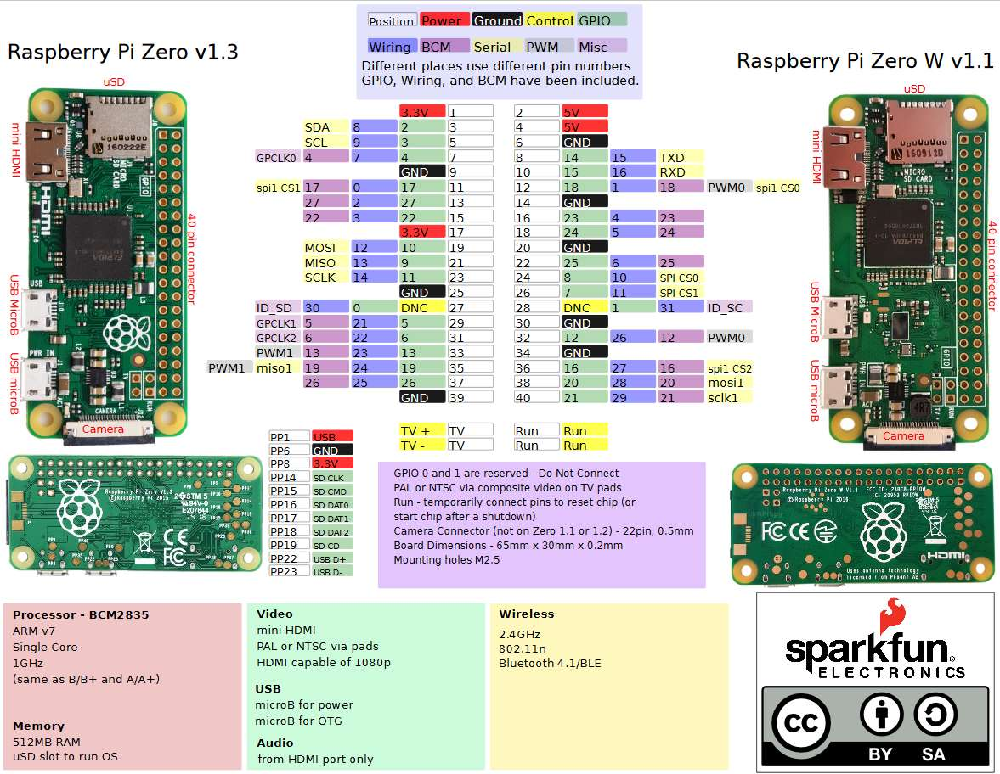

# Raspberry Pi Zero

Unfortunately PlatformIO doesn't support cross-platform compilation of code. You'll need to run it directly on the Pi itself.

## Create an image

Burn a Rasbian image https://www.raspbian.org on a SDcard using the Raspbian Installer or [Balena Etcher](https://www.balena.io/etcher).

## Modify the image

In order to use the Pi as a tethering device some changes to the configuration have to be made. Mount the SDcard and check if the volume is accessible.

```shell
ls -l /Volumes/boot
```

### Enable SSH

```shell
touch /Volumes/boot/ssh
```

### Set overlay

```shell
echo 'dtoverlay=dwc2' >> /Volumes/boot/config.txt
```

### Add modules

```shell
echo ' modules-load=dwc2,g_ether' >> /Volumes/boot/cmdline.txt
```

Please check that there's only one space between rootwait and this text, otherwise parsing might fail.

### Generate a keypair

```shell
ssh-keygen -R raspberrypi.local
```

## Connection over USB

Get a USB data cable (4 connected wires instead of 2) and connect it to the USB port labeled USB (not PWR).

In the Network section of the System Settings you'll find a RNDIS/Ethernet Gadget with a self assigned IP address.

Connect to the Pi over SSH:

```shell
ssh pi@raspberry.local
```

## Internet access

In order to download stuff on the Pi from the internet, the Sharing option should be turned on in the General section of the System Settings for the RNDIS/Ethernet on the network connection used.

See also: https://support.apple.com/en-gb/guide/mac-help/mchlp1540/mac

If Internet Sharing is already active and you want to make changes: turn it off, make the change and turn it back on again.

## Pinout


