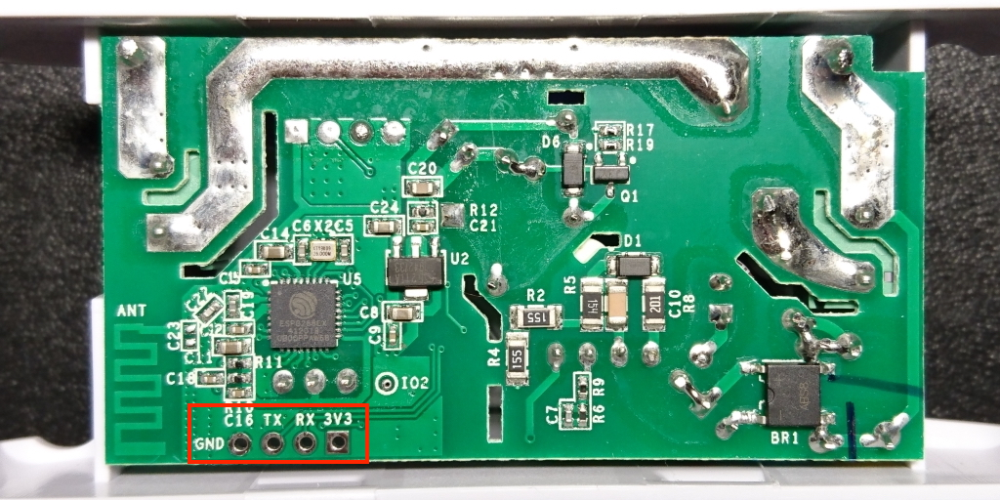
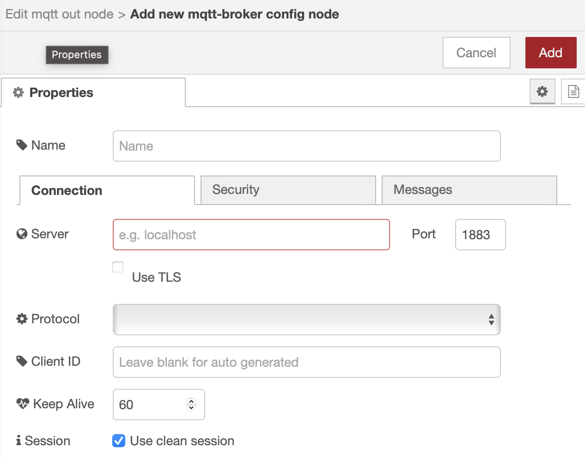
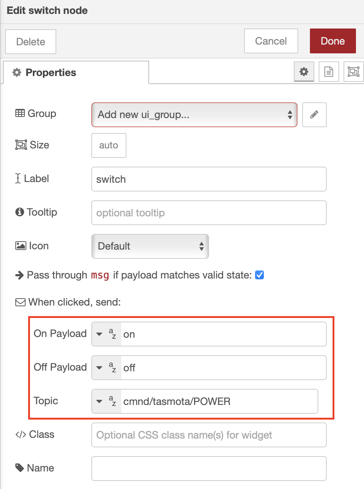

# Sonoff Basic R2

This Sonoff device is basically a board with a relais and an ESP8266 chip (ESP8285 to be precise) that can be controlled via WiFi (although there's a Zigbee variant) The switch is normally controlled over the internet via the eWeLink app, but with a bit of tinkering you can add these devices to your smart home with the help of MQTT.

The firmware can be either EPS Home (https://esphome.io) or Tasmota (https://tasmota.github.io/docs/). The following instructions use the latter.



## Prerequisites

- USB to Serial UART bridge (3.3V)
- Flashing Tool e.g. Tasmotizer
  - https://github.com/tasmota/tasmotizer
  - `pip3 install --upgrade pip wheel`
  - `pip3 install tasmotizer`
- 4 pins header
- Soldering Iron
- WiFi enabled network
- Running MQTT Broker e.g. Mosquitto
  - https://mqtt.org/software/

## Procedure

The following steps follow the _happy path_.

- Disconnect the device from mains.
- Open up the Sonoff case.
- Take out the circuit board.
- Locate the serial connector.
- Solder on the header.
- Connect the 4 pins from the UART to the header.
  - Make sure the voltage is 3.3V and not 5V!
  - Swap the TX and RX pins (sometimes they [intentionally?] mislabel these connections, but if the connection fails, just swap again).
- Insert the UART bridge into an USB port while holding the button on the Sonoff and release after 3 seconds. The device is now in flash mode.
- Start the flasher:
  - `python3 -m tasmotizer.py`
- Select the **port**:
  - E.g. /dev/wchusb.serial.tty
- Select **image**:
  - Check **Release** and select the right (language) `.bin` file.
- Click **Tasmotize!**
- Once flashing is complete, un- and replug the UART bridge.
- Click **Send config**.
- Fill in the details:
  - WiFi SSID and password.
  - MQTT broker and topic info.
  - Select _Sonoff Basic_ module from the list.
  - Click **Save**.
- After the reboot (and a while) click **Get IP**.
- Open up a browser to that IP.
- On the UI click the toggle button to verify communication is working.
- Put the Sonoff back in its casing.
- Connect the device to mains and e.g. a lightbulb.
- Toggle again and let there be light! ;-)

## Configuration

Tasmota integrates with multiple smart home solutions because of MQTT. This example uses Node-Red which has MQTT support built in.

### Install Node-Red

- Install NodeJS
  - https://nodejs.org/en/download/package-manager
- `npm install -g --unsafe-perm node-red`
- `node-red`
- Open up a browser to http://localhost:1880

### Build Flow

- Add **MQTT out** node:
  

- Add **Switch**
  

  The topics and payloads can be found here: https://tasmota.github.io/docs/MQTT/

- Result
  

- The code

```json
[
  {
    "id": "f7c78fd59477dbeb",
    "type": "tab",
    "label": "Flow 2",
    "disabled": false,
    "info": "",
    "env": []
  },
  {
    "id": "72895310abe5ebd4",
    "type": "ui_switch",
    "z": "f7c78fd59477dbeb",
    "name": "",
    "label": "switch",
    "tooltip": "",
    "group": "",
    "order": 0,
    "width": 0,
    "height": 0,
    "passthru": true,
    "decouple": "false",
    "topic": "cmnd/tasmota/POWER",
    "topicType": "str",
    "style": "",
    "onvalue": "on",
    "onvalueType": "str",
    "onicon": "",
    "oncolor": "",
    "offvalue": "off",
    "offvalueType": "str",
    "officon": "",
    "offcolor": "",
    "animate": false,
    "className": "",
    "x": 490,
    "y": 160,
    "wires": [["bc84c70acd328027"]]
  },
  {
    "id": "bc84c70acd328027",
    "type": "mqtt out",
    "z": "f7c78fd59477dbeb",
    "name": "",
    "topic": "",
    "qos": "",
    "retain": "",
    "respTopic": "",
    "contentType": "",
    "userProps": "",
    "correl": "",
    "expiry": "",
    "x": 690,
    "y": 160,
    "wires": []
  }
]
```
